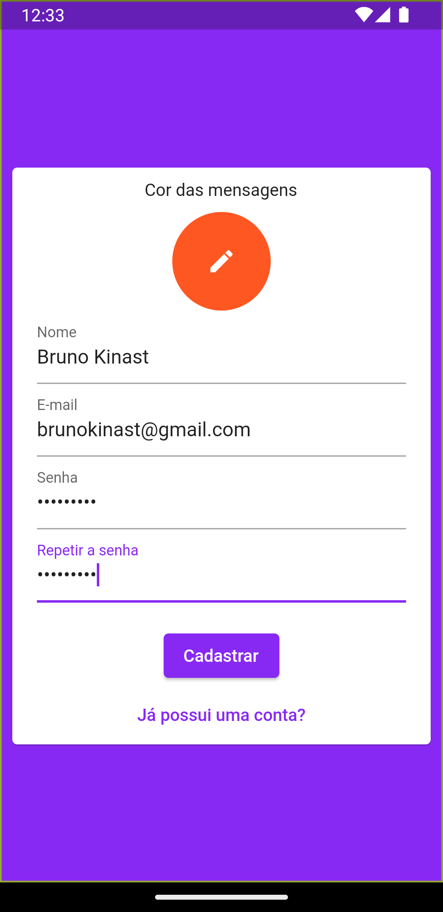
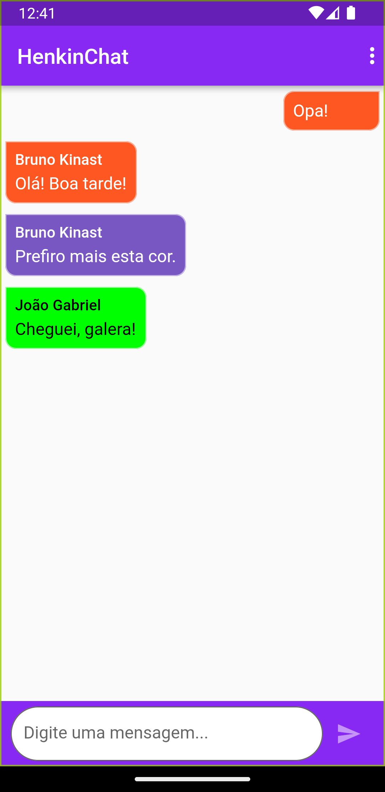

# HenkinChat

Um chat desenvolvido usando Firebase.

## Screenshots

## Como usar

1. Clone o repositório
2. Crie um projeto no Firebase
3. Ative o Firebase Auth e o Cloud Firestore
4. Use `flutterfire configure` para configurar o projeto
5. Use `flutter run` para rodar o projeto

